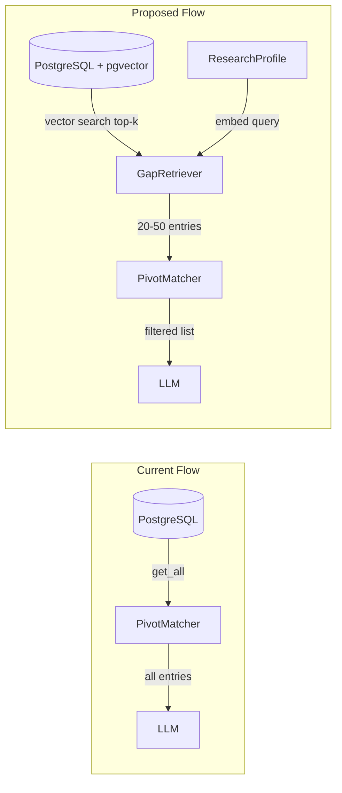

# Scalable Retrieval and Evaluation Framework Plan

## Part 1: Scalable Retrieval for Pivot Matching

### Current Problem

The pivot matcher receives **all** gap entries from the DB and passes them to the LLM in one prompt. With ~1,500 entries (Convergent ~170, Homeworld ~52, Wikenigma ~1,266, 3ie ~42), the prompt can exceed 100K tokens and hit context limits, latency, and cost.

### Architecture: Two-Stage Retrieval




### Implementation

**1. Add pgvector to PostgreSQL**

- Use `pgvector/pgvector` or `ankane/pgvector` Docker image (or install extension on existing postgres:15)
- Update [docker-compose.yml](docker-compose.yml) to use pgvector-enabled image
- Add Alembic migration to create `embedding` column (`vector(1536)` for text-embedding-3-small) on `gap_map_entries`
- Create index: `CREATE INDEX ON gap_map_entries USING ivfflat (embedding vector_cosine_ops) WITH (lists = 100);`

**2. Embedding Service**

- New module: `app/services/embedding_service.py`
- Use OpenAI `text-embedding-3-small` (1536 dims, cheap)
- `embed_text(text: str) -> list[float]`
- Batch embedding for bulk indexing (OpenAI supports up to 2048 inputs per request)

**3. Gap Map Embedding Pipeline**

- New module: `app/services/gap_map_embedder.py`
- For each `GapMapEntry`, concatenate: `f"{title} {description} {' '.join(tags)}"`
- Compute embedding, store in DB
- Trigger: run after `scrape_and_store()` in orchestrator; also add CLI or startup job to backfill existing entries

**4. Gap Retriever**

- New module: `app/services/gap_retriever.py`
- `retrieve(profile: ResearchProfile, novelty: NoveltyAssessment, limit: int = 50) -> list[GapMapEntry]`
- Query text: `f"{profile.research_question} {' '.join(profile.skills)} {' '.join(profile.expertise_areas)} {' '.join(profile.motivations)}"`
- Embed query, run `SELECT * FROM gap_map_entries ORDER BY embedding <=> query_embedding LIMIT 50`
- Optional pre-filter: if profile has strong category overlap, filter by category first (reduces search space)

**5. Integrate into Pivot Matcher and Routes**

- [routes.py](research-advisor-backend/app/api/routes.py): Replace `repo.get_all()` with `gap_retriever.retrieve(merged_profile, novelty, limit=50)`
- [pivot_matcher.py](research-advisor-backend/app/services/pivot_matcher.py): No change to LLM logic; it receives pre-filtered list
- Add config: `GAP_RETRIEVAL_TOP_K` (default 50), `GAP_USE_VECTOR_SEARCH` (default true, fallback to get_all when false or no embeddings)

**6. Dependencies**

- `pgvector` (Python package)
- `openai` already present (for embeddings)

### Fallback Behavior

- If `embedding` column is null for all entries (e.g., first run before backfill): fall back to `get_all()` and optionally truncate to first N entries to avoid context overflow
- If pgvector extension unavailable: fall back to keyword pre-filter (e.g., `get_by_category` if profile expertise matches) or simple truncation

---

## Part 2: Evaluation Framework

### Goals

- Detect regressions when changing prompts or logic
- Benchmark novelty/impact analysis quality
- Optional: benchmark pivot matching

### Structure

```
research-advisor-backend/
  tests/
    evaluation/
      __init__.py
      benchmarks/
        novelty_benchmark.json      # Benchmark dataset
        pivot_benchmark.json        # Optional
      conftest.py                  # Shared fixtures for eval
      test_novelty_regression.py   # Regression tests
      test_pivot_regression.py     # Optional
      run_evaluation.py            # CLI to run full eval and report
```

### Benchmark Dataset: Novelty

**File:** `tests/evaluation/benchmarks/novelty_benchmark.json`

```json
[
  {
    "id": "solved_1",
    "research_question": "What is the structure of DNA?",
    "expected_verdict": "SOLVED",
    "expected_impact": "HIGH",
    "notes": "Classic solved problem"
  },
  {
    "id": "novel_1",
    "research_question": "Can CRISPR be used to edit mitochondrial DNA in vivo?",
    "expected_verdict": "NOVEL",
    "expected_impact": "HIGH",
    "notes": "Emerging, partially addressed"
  },
  {
    "id": "marginal_1",
    "research_question": "Incremental improvement of gradient descent for image classification",
    "expected_verdict": "MARGINAL",
    "expected_impact": "LOW",
    "notes": "Saturated area"
  }
]
```

- Start with 6–10 curated cases covering SOLVED, MARGINAL, NOVEL, UNCERTAIN
- Include variety of domains (life sciences, CS, social)
- `expected_impact` can be optional (HIGH/MEDIUM/LOW) for impact regression

### Regression Test: Novelty

**File:** `tests/evaluation/test_novelty_regression.py`

- Load benchmark from JSON
- For each case: call `NoveltyAnalyzer.analyze(research_question)` with mocked OpenAlex (return fixed papers per case to avoid flakiness)
- Assert: `result.verdict == expected_verdict` (strict) or allow fuzzy match (e.g., MARGINAL vs UNCERTAIN)
- Use `@pytest.mark.slow` or `@pytest.mark.evaluation` so it can be skipped in fast CI
- Optional: assert `result.impact_assessment == expected_impact` when provided

### Mocked OpenAlex for Benchmark

- Each benchmark case can specify `mock_papers` (optional): list of paper dicts to return
- If not specified, use a generic fixture (e.g., medium-FWCI papers) so tests are deterministic
- This avoids real OpenAlex calls and makes tests fast and reproducible

### Evaluation Runner

**File:** `tests/evaluation/run_evaluation.py`

- CLI: `python -m tests.evaluation.run_evaluation`
- Runs all benchmark cases, prints pass/fail and a summary table
- Optional: output JSON report for CI artifact
- Can run with real OpenAlex (slower) via `--live` flag for periodic validation

### Pivot Benchmark (Optional, Lower Priority)

- `pivot_benchmark.json`: cases with `research_question`, `skills`, `expected_gap_titles` (list of titles that should appear in top 5)
- Harder to maintain (gap catalog changes); consider skipping initially

---

## File Summary


| File                                                 | Action                                         |
| ---------------------------------------------------- | ---------------------------------------------- |
| `docker-compose.yml`                                 | Switch postgres image to pgvector-enabled      |
| `alembic/versions/xxx_add_embedding.py`              | Add embedding column + index                   |
| `app/services/embedding_service.py`                  | New: OpenAI embedding wrapper                  |
| `app/services/gap_map_embedder.py`                   | New: batch embed and store                     |
| `app/services/gap_retriever.py`                      | New: vector search retrieval                   |
| `app/services/gap_map_scraper.py`                    | Call embedder after scrape_and_store           |
| `app/api/routes.py`                                  | Use GapRetriever instead of get_all            |
| `app/config.py`                                      | Add GAP_RETRIEVAL_TOP_K, GAP_USE_VECTOR_SEARCH |
| `tests/evaluation/benchmarks/novelty_benchmark.json` | New: benchmark dataset                         |
| `tests/evaluation/test_novelty_regression.py`        | New: regression tests                          |
| `tests/evaluation/run_evaluation.py`                 | New: eval runner CLI                           |
| `pyproject.toml`                                     | Add pgvector dependency                        |


---

## Phasing

**Phase A: Retrieval (Scalability)**

1. pgvector setup (Docker, migration)
2. Embedding service + gap embedder
3. Gap retriever
4. Wire into routes; fallback when no embeddings

**Phase B: Evaluation**

1. Create novelty benchmark JSON (6–10 cases)
2. Regression test with mocked OpenAlex
3. Evaluation runner CLI
4. Add to CI (optional, as separate job or nightly)

---

## Open Questions

1. **pgvector Docker image**: Use `pgvector/pgvector` (community) or `ankane/pgvector`? Both extend postgres. Default: `pgvector/pgvector` (widely used).
2. **Embedding model**: `text-embedding-3-small` (1536 dims) vs `text-embedding-3-large` (3072)? Small is cheaper and sufficient for retrieval.
3. **Benchmark size**: Start with 6–10 cases; expand over time based on failures and edge cases.

