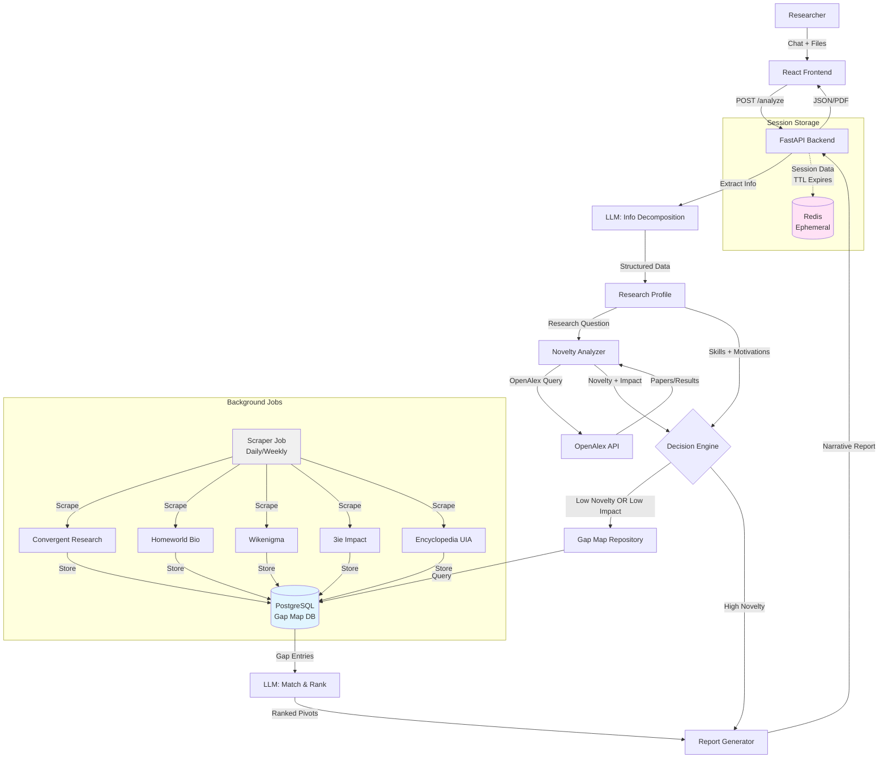

# Research Pivot Advisor System - Architecture Plan

## System Overview

A standalone application that helps researchers (PhD/Post-Doc) evaluate whether their research direction is worth pursuing or if they should pivot. The system collects three key inputs (research question, skills, motivations), analyzes novelty through literature review, and provides actionable recommendations.

## Architecture

### High-Level Flow




### Component Breakdown

#### 1. Frontend (React + TypeScript)

**Location:** `research-advisor-frontend/`

**Key Components:**

- **Chat Interface** (`components/ChatInterface.tsx`)
  - Multi-turn conversation flow
  - File upload support (PDF, DOCX, TXT)
  - Progress indicators for multi-step collection
- **File Upload Handler** (`components/FileUpload.tsx`)
  - Drag-and-drop support
  - File type validation
  - Preview for uploaded documents
- **Results Display** (`components/ResultsView.tsx`)
  - Narrative report rendering
  - Continue vs Pivot recommendation
  - Pivot suggestions with links
  - Evidence citations

**State Management:**

- TanStack Query for API calls
- React Context for session state
- Local storage for draft responses

#### 2. Backend (FastAPI + Python)

**Location:** `research-advisor-backend/`

**Core Modules:**

**2.1 Information Collection Service** (`app/services/info_collector.py`)

- **Purpose:** Extract structured information from chat + files
- **Input:** Chat messages, uploaded files (PDFs, resumes, proposals)
- **Output:** `ResearchProfile` schema
- **Implementation:**
  - Use LLM (GPT-4) to extract:
    - Research question/problem statement
    - Skills/expertise areas
    - Motivations/interests
  - Support both text extraction (from chat) and document parsing (PDFs)
  - Handle multi-file scenarios (proposal + resume)

**2.2 Novelty & Impact Analyzer** (`app/services/novelty_analyzer.py`)

- **Purpose:** Determine if research is novel, already solved, or marginal (low impact)
- **Input:** Research question/problem statement
- **Output:** `NoveltyAssessment` schema
- **Implementation:**
  - Query OpenAlex API for related papers
  - Extract FWCI (Field Weighted Citation Impact) metrics from results:
    - Average FWCI of related papers
    - FWCI distribution (percentiles)
    - Citation percentile rankings
  - Use LLM to interpret results:
    - Is this already solved?
    - Is this marginal/incremental? (check FWCI < 1.0 or low citation percentiles)
    - Is this novel/generative?
    - What is the impact potential? (based on FWCI trends)
  - Return novelty score (0.0-1.0) + impact assessment + evidence
  - **Key Logic:** If related papers have low FWCI (< 1.0) or are in bottom percentiles, flag as marginal research area

**2.3 Gap Map Database & Scraper** (`app/services/gap_map_scraper.py` + `app/models/gap_map_models.py`)

- **Purpose:** Store and retrieve gap map data from database (scraped once, not on-demand)
- **Sources:**
  1. Convergent Research Gap Map ([https://www.gap-map.org/](https://www.gap-map.org/))
  2. Homeworld Problem Statement Repository ([https://www.homeworld.bio/research/problem-statement-repository/](https://www.homeworld.bio/research/problem-statement-repository/))
  3. Wikenigma ([https://wikenigma.org.uk/](https://wikenigma.org.uk/))
  4. 3ie Impact Evidence Gap Maps ([https://www.3ieimpact.org/evidence-hub/evidence-gap-maps](https://www.3ieimpact.org/evidence-hub/evidence-gap-maps))
  5. Encyclopedia of World Problems ([https://encyclopedia.uia.org/](https://encyclopedia.uia.org/))
- **Database Storage:**
  - Use PostgreSQL database to store scraped gap map entries
  - Table: `gap_map_entries` with columns matching `GapMapEntry` schema
  - Index on `category`, `tags`, `source` for efficient querying
  - Store `scraped_at` timestamp for refresh tracking
- **Scraping Implementation:**
  - **Background Job:** Run scraping as scheduled task (daily/weekly), NOT on-demand
  - Use Oxylabs proxy service for scraping
  - Parse HTML/JSON from each source
  - Normalize data into common schema (`GapMapEntry`)
  - Upsert into database (update existing entries, insert new ones)
  - Track scraping status and errors
- **Retrieval:**
  - Query database for gap map entries (no scraping during user requests)
  - Filter by category/tags if needed for matching
  - Return all entries or filtered subset for pivot matching

**2.4 Pivot Matcher** (`app/services/pivot_matcher.py`)

- **Purpose:** Match researcher profile to relevant gap map entries, prioritizing high-impact problems
- **Input:** ResearchProfile + GapMapEntries (from database) + NoveltyAssessment
- **Output:** Ranked list of pivot suggestions
- **Implementation:**
  - Query database for gap map entries (no scraping)
  - Use LLM to:
    - Understand researcher motivations
    - Match skills to problem requirements
    - Assess impact potential of gap map entries (based on source credibility, problem scope)
    - Rank by: relevance + feasibility + impact potential
  - **Impact Weighting:** Prioritize suggestions that:
    - Address fundamental gaps (vs incremental improvements)
    - Come from credible sources (Convergent Research, Homeworld)
    - Align with researcher's skills but offer higher impact trajectory
  - Return top N suggestions with explanations and impact rationale

**2.5 Report Generator** (`app/services/report_generator.py`)

- **Purpose:** Generate narrative report with recommendations
- **Input:** ResearchProfile + NoveltyAssessment + PivotSuggestions
- **Output:** Narrative report (markdown/PDF)
- **Implementation:**
  - Use LLM to write structured narrative:
    - Executive summary
    - Novelty analysis findings (including FWCI/impact metrics)
    - Impact assessment (why current research is marginal/high-impact)
    - Continue vs Pivot recommendation (considering both novelty AND impact)
    - Pivot suggestions (if applicable) with impact rationale
    - Evidence citations (including OpenAlex FWCI data)

#### 3. Data Schemas (`app/models/schemas.py`)

```python
class ResearchProfile(BaseModel):
    """Structured profile extracted from user input."""
    research_question: str
    problem_description: str | None
    skills: list[str]
    expertise_areas: list[str]
    motivations: list[str]
    interests: list[str]
    extracted_from_files: list[str]  # File names used

class NoveltyAssessment(BaseModel):
    """Novelty and impact analysis results."""
    score: float  # 0.0 (solved/marginal) to 1.0 (novel)
    verdict: Literal["SOLVED", "MARGINAL", "NOVEL", "UNCERTAIN"]
    evidence: list[Citation]
    reasoning: str
    related_papers_count: int
    
    # Impact metrics from OpenAlex FWCI
    average_fwci: float | None  # Average FWCI of related papers
    fwci_percentile: float | None  # Percentile of FWCI distribution
    citation_percentile_min: int | None  # Min citation percentile (from cited_by_percentile_year)
    citation_percentile_max: int | None  # Max citation percentile
    impact_assessment: Literal["HIGH", "MEDIUM", "LOW", "UNCERTAIN"]
    impact_reasoning: str  # Explanation of impact assessment

class GapMapEntry(BaseModel):
    """Normalized gap map entry from any source."""
    title: str
    description: str
    source: Literal["convergent", "homeworld", "wikenigma", "3ie", "encyclopedia"]
    source_url: str
    category: str | None
    tags: list[str]

class PivotSuggestion(BaseModel):
    """Suggested research pivot."""
    gap_entry: GapMapEntry
    relevance_score: float  # 0.0-1.0 match to researcher profile
    impact_potential: Literal["HIGH", "MEDIUM", "LOW"]  # Estimated impact potential
    match_reasoning: str  # Why this matches their skills/motivations
    feasibility_for_researcher: str  # Assessment of feasibility given their skills
    impact_rationale: str  # Why this problem has higher impact potential than current research

class ResearchRecommendation(BaseModel):
    """Final recommendation report."""
    recommendation: Literal["CONTINUE", "PIVOT", "UNCERTAIN"]
    confidence: float
    narrative_report: str
    novelty_assessment: NoveltyAssessment
    pivot_suggestions: list[PivotSuggestion]
    evidence_citations: list[Citation]
```

#### 4. API Endpoints (`app/main.py`)

```python
POST /api/v1/analyze
  - Request: { messages: list[ChatMessage], files: list[UploadFile] }
  - Response: { session_id: str, status: "processing" }
  - Privacy: Session data stored in-memory/Redis with TTL, not persisted

GET /api/v1/analysis/{session_id}
  - Response: ResearchRecommendation
  - Privacy: Session expires after TTL, data deleted

POST /api/v1/chat
  - Request: { session_id: str, message: str }
  - Response: { response: str, next_step: str }
  - Privacy: Chat messages only stored in session (temporary)

DELETE /api/v1/session/{session_id}
  - Response: { deleted: true }
  - Privacy: Immediately delete all session data
```

#### 5. Background Jobs (`app/jobs/`)

**Gap Map Scraper Job** (`app/jobs/gap_map_scraper_job.py`)

- Scheduled task (daily/weekly) to scrape all gap map sources
- Updates PostgreSQL database with latest entries
- Runs independently of user requests
- Logs scraping status and errors

#### 6. Database Schema (`app/models/gap_map_models.py`)

**Gap Map Entry Table:**

```python
class GapMapEntry(Base):
    __tablename__ = "gap_map_entries"
    
    id = Column(Integer, primary_key=True)
    title = Column(String, nullable=False)
    description = Column(Text)
    source = Column(String, nullable=False)  # "convergent", "homeworld", etc.
    source_url = Column(String, nullable=False)
    category = Column(String, nullable=True)
    tags = Column(ARRAY(String))  # PostgreSQL array type
    scraped_at = Column(DateTime, nullable=False)
    created_at = Column(DateTime, default=datetime.utcnow)
    updated_at = Column(DateTime, onupdate=datetime.utcnow)
    
    # Indexes for efficient querying
    __table_args__ = (
        Index('idx_source', 'source'),
        Index('idx_category', 'category'),
        Index('idx_scraped_at', 'scraped_at'),
    )
```

**Key Points:**

- No user data stored in this table (only public gap map data)
- Upsert logic: Update existing entries by `source` + `source_url`, insert new ones
- Indexes on frequently queried fields for performance

## Implementation Phases

### Phase 1: Foundation & Information Collection

**Files to Create:**

- `research-advisor-backend/app/models/schemas.py` - All Pydantic schemas
- `research-advisor-backend/app/services/info_collector.py` - LLM-based extraction
- `research-advisor-backend/app/services/document_parser.py` - PDF/text parsing
- `research-advisor-backend/app/main.py` - FastAPI app with basic endpoints
- `research-advisor-frontend/src/components/ChatInterface.tsx` - Chat UI
- `research-advisor-frontend/src/components/FileUpload.tsx` - File upload component

**Key Tasks:**

- Set up FastAPI project structure
- Implement document parsing (PDF, DOCX, TXT)
- Create LLM prompt for extracting research profile
- Build chat interface with file upload
- Test end-to-end information collection

### Phase 2: Novelty & Impact Analysis

**Files to Create:**

- `research-advisor-backend/app/services/novelty_analyzer.py` - OpenAlex integration with FWCI analysis
- `research-advisor-backend/app/services/openalex_client.py` - OpenAlex API wrapper with FWCI extraction

**Key Tasks:**

- Integrate OpenAlex API (reuse patterns from GCIS Scientist agent)
- Extract FWCI metrics from OpenAlex responses:
  - Parse `fwci` field from each work
  - Extract `citation_normalized_percentile` and `cited_by_percentile_year`
  - Calculate average FWCI and distribution statistics
- Create LLM prompt for interpreting OpenAlex results + FWCI metrics:
  - Determine if research is marginal (low FWCI, low citation percentiles)
  - Assess impact potential based on field trends
- Implement novelty + impact scoring logic:
  - Novelty score (0.0-1.0) based on solution status
  - Impact assessment (HIGH/MEDIUM/LOW) based on FWCI metrics
- Test with known solved vs novel vs marginal research questions

### Phase 3: Gap Map Database & Scraping

**Files to Create:**

- `research-advisor-backend/app/models/gap_map_models.py` - SQLAlchemy models for gap map entries
- `research-advisor-backend/app/services/gap_map_scraper.py` - Main scraper orchestrator
- `research-advisor-backend/app/services/scrapers/convergent_scraper.py`
- `research-advisor-backend/app/services/scrapers/homeworld_scraper.py`
- `research-advisor-backend/app/services/scrapers/wikenigma_scraper.py`
- `research-advisor-backend/app/services/scrapers/threeie_scraper.py`
- `research-advisor-backend/app/services/scrapers/encyclopedia_scraper.py`
- `research-advisor-backend/app/services/oxylabs_client.py` - Oxylabs proxy client
- `research-advisor-backend/app/services/gap_map_repository.py` - Database query interface
- `research-advisor-backend/app/jobs/gap_map_scraper_job.py` - Background scraping job
- `research-advisor-backend/alembic/` - Database migrations

**Key Tasks:**

- Set up PostgreSQL database and SQLAlchemy models
- Create database schema for gap_map_entries table
- Set up Alembic for database migrations
- Set up Oxylabs proxy integration
- Implement HTML parsing for each source
- Create normalization logic (GapMapEntry schema)
- Implement database upsert logic (update existing, insert new)
- Set up background job scheduler (Celery or APScheduler)
- Configure scheduled scraping (daily/weekly)
- Handle rate limiting and error cases
- Create database query interface for retrieving entries

### Phase 4: Pivot Matching & Report Generation

**Files to Create:**

- `research-advisor-backend/app/services/pivot_matcher.py` - LLM-based matching with impact weighting
- `research-advisor-backend/app/services/report_generator.py` - Narrative report creation

**Key Tasks:**

- Create LLM prompt for matching researcher profile to gaps:
  - Consider current research's impact assessment (from NoveltyAssessment)
  - Prioritize gap map entries with higher impact potential
  - Explain why pivot would be more impactful than continuing
- Implement ranking/scoring logic:
  - Relevance score (skills/motivation match)
  - Impact potential score (based on source credibility, problem scope)
  - Combined ranking: relevance × impact_weight
- Build report generation pipeline:
  - Include FWCI analysis in narrative
  - Explain impact comparison (current vs suggested pivots)
  - Highlight why pivots offer better impact trajectory
- Format citations and evidence properly

### Phase 5: Frontend Integration & Polish

**Files to Create:**

- `research-advisor-frontend/src/components/ResultsView.tsx` - Results display
- `research-advisor-frontend/src/api/client.ts` - API client
- `research-advisor-frontend/src/hooks/useAnalysis.ts` - TanStack Query hooks

**Key Tasks:**

- Connect frontend to backend APIs
- Implement results visualization
- Add loading states and error handling
- Polish UI/UX

## FWCI-Based Impact Assessment

### Understanding Field Weighted Citation Impact (FWCI)

FWCI is a normalized citation metric from OpenAlex that compares a paper's citations to the field average:

- **FWCI = 1.0**: Average impact for the field
- **FWCI > 1.0**: Above average impact (e.g., FWCI 3.43 = 3.43× field average)
- **FWCI < 1.0**: Below average impact (marginal research)

### FWCI Analysis Logic

**1. Extract FWCI from OpenAlex Results:**

```python
# From OpenAlex API response (example: https://api.openalex.org/w4246506258)
work = {
    "fwci": 3.43300483,
    "citation_normalized_percentile": {"value": 0.93448695, "is_in_top_10_percent": True},
    "cited_by_percentile_year": {"min": 94, "max": 99}
}
```

**2. Analyze Related Papers:**

- Query OpenAlex for papers related to researcher's question
- Extract FWCI for each related paper
- Calculate statistics:
  - Average FWCI of related papers
  - FWCI distribution (percentiles)
  - Citation percentile ranges

**3. Determine Impact Assessment:**

- **HIGH Impact:** Average FWCI > 1.5, papers in top 25% citation percentiles
- **MEDIUM Impact:** Average FWCI 0.8-1.5, papers in middle percentiles
- **LOW Impact:** Average FWCI < 0.8, papers in bottom percentiles
- **MARGINAL Research:** If related papers consistently show low FWCI (< 1.0), this suggests the research area itself has low impact potential

**4. Decision Logic:**

- If research is **NOVEL** but **LOW impact** (marginal area) → Recommend **PIVOT** to higher-impact problems
- If research is **SOLVED** or **MARGINAL** → Recommend **PIVOT** regardless
- If research is **NOVEL** and **HIGH impact** → Recommend **CONTINUE**

**5. Pivot Matching Enhancement:**

- When suggesting pivots, prioritize gap map entries that:
  - Address fundamental problems (likely higher impact)
  - Come from credible sources (Convergent Research, Homeworld)
  - Align with researcher's skills but offer better impact trajectory
- Use LLM to compare impact potential: "Your current research area shows FWCI < 1.0, suggesting marginal impact. These pivot suggestions address fundamental gaps with higher impact potential."

## Technical Considerations

### External Dependencies

- **LLM:** OpenAI GPT-4 (latest model) via `langchain-openai`
- **OpenAlex:** `pyalex` library (same as GCIS)
- **Scraping:** Oxylabs proxy service (HTTP requests via `httpx` or `requests`)
- **Document Parsing:** `pypdf2` or `unstructured` (same as GCIS)
- **Caching:** Redis (for gap map data, session state)

### Configuration

- Create separate `.env` file for API keys:
  - `OPENAI_API_KEY` (required)
  - `OPENALEX_EMAIL` (optional, for polite pool)
  - `OXYLABS_USERNAME` / `OXYLABS_PASSWORD` (required for scraping)
  - `DATABASE_URL` (required, PostgreSQL connection string)
  - `REDIS_URL` (optional, defaults to localhost, for session storage only)
  - `SESSION_TTL_SECONDS` (optional, defaults to 3600 = 1 hour)

### Error Handling

- All external API calls should handle failures gracefully
- Return "Uncertain" status if APIs fail
- Log errors but don't crash the application
- Provide user-friendly error messages in UI

### Performance

- Gap map data stored in PostgreSQL (no on-demand scraping)
- Background job refreshes gap map data (daily/weekly)
- Use async/await for all I/O operations
- Implement request queuing for Oxylabs (rate limits) in background job
- Database indexes on frequently queried fields (category, tags, source)

## Privacy & Security

### Data Isolation & Privacy

**Core Principle:** User research ideas and data are NEVER persisted or shared. All user data is session-based and ephemeral.

**1. Session-Based Storage:**

- User research questions, skills, motivations stored ONLY in Redis with TTL
- Session expires after configured TTL (default: 1 hour)
- No persistent database storage of user research ideas
- Each session is isolated (no cross-session data access)

**2. Data Deletion:**

- Session data automatically deleted after TTL expires
- User can explicitly delete session via DELETE endpoint
- No backups or archives of user research data
- Gap map data (public) stored separately from user data

**3. LLM API Calls:**

- User data sent to LLM only for processing (not stored by LLM provider)
- Consider using OpenAI's data usage policies (data not used for training)
- No logging of user research questions/ideas in application logs
- Log only metadata (session_id, timestamps, errors) - no content

**4. File Uploads:**

- Files stored temporarily in memory or temp directory
- Deleted immediately after processing
- No persistent file storage
- Files not shared between users or sessions

**5. Database Separation:**

- Gap map entries (public data) in PostgreSQL
- User session data in Redis (ephemeral)
- No user research data in PostgreSQL
- Clear separation of concerns

**6. Encryption:**

- Encrypt sensitive data in transit (HTTPS/TLS)
- Consider encrypting session data at rest in Redis (optional)
- Database connections use SSL/TLS

**7. Access Control:**

- No user authentication required (anonymous sessions)
- Session IDs are UUIDs (not guessable)
- No cross-session data access
- Rate limiting to prevent abuse

**8. Privacy Policy Compliance:**

- Clear privacy policy explaining data handling
- No data sharing with third parties (except LLM provider for processing)
- No data retention beyond session TTL
- User can request immediate deletion

## Testing Strategy

- **Unit Tests:** Test each service independently with mocked APIs
- **Integration Tests:** Test OpenAlex integration (skip if no API key)
- **E2E Tests:** Test full flow with sample research questions
- **Scraping Tests:** Test each scraper with sample HTML (don't hit live sites in CI)

## Deployment Considerations

- Separate Docker containers for frontend/backend/database
- PostgreSQL database for gap map storage
- Redis for session storage (ephemeral)
- Background job worker for gap map scraping
- Environment variable management
- Rate limiting for external APIs
- Monitoring for scraping success rates
- Privacy compliance: Ensure no user data persistence beyond session TTL
- Regular security audits of data handling

